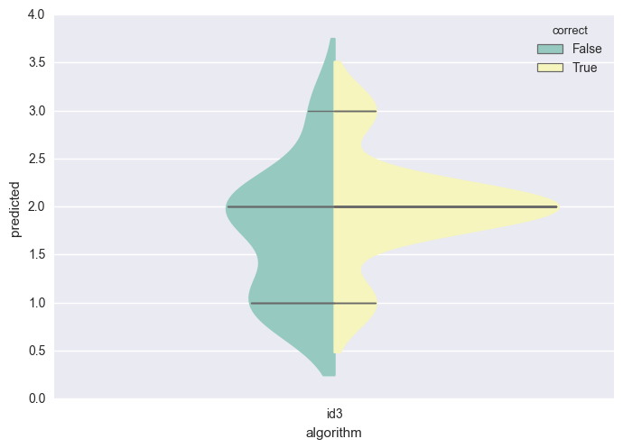
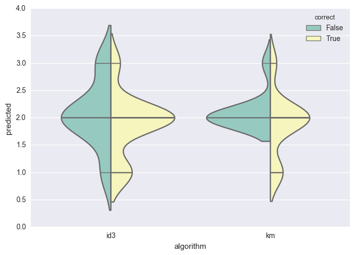
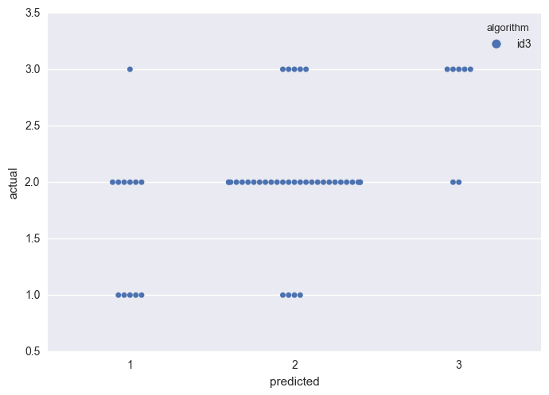

# Assignment 3: ID3 Classifier

**Author** Richard Protasov, **Date** 22 October 2016

### Installing, building, and so on

Everything that needs to be taken care of is done by Haskell's package manager, Cabal.

Entering

```
% make run
```

will take care of builing the package in addition to executing the `prep`, `train`, and `test` executalbes. The installtion process may be a while, but, the exectuables are fairly short.

The paper requires several files made by the above exectuables, however, the folder includes correctly processed data from the start.

A visual of the decision tree requires the above mentioned steps.

After, type

```
% make server
```

which will start a local web server and open a browser tab pointing to its address (in case this doesn't work the URL is `http://localhost:8000` and can be changed if needed to). Again, a visual is included without having to do this.

### Overview

What makes a burrito enjoyable? The burrito is the hallmark of delicous taco shop food: tasty, inexpensive, and filling, yet, the characetirs of a good burrito is open to discussion. To provide insight several classifiers are trained on a [San Diego survey](https://www.kaggle.com/srcole/burritos-in-san-diego) consisisting of various core dimenisons of over 200 burritos. The selected features are

- cost
- hunger
- torilla
- meat
- fillings
- meat to filling ratio
- uniformity
- wrap integrity

In addition, the feature we are interested in predicting is the summary statisisc of an indicivuals overall rating for the burrito. Hence, we can judge whether the burrito has what it takes to make it. To take a go at this two classifier are trained. One classifier being the ID3 decision tree learning algorithm developed by Ross Quinlan. The second classifier is a modified nearest-neighbors algorithm.

### About the dataset

Oh ya, let's discuss that data set.

### Experiments

So we've got our talk down about what's going on with the dataset. Let's start digging for some information from testing.

Here we can talk about some of our results. Oh look a pretty graph. Let's talk about it!


```python
%matplotlib inline
import seaborn as sns
import pandas as pd

compare = pd.read_csv("data/compare.csv")

sns.violinplot(
    x="algorithm",
    y="predicted",
    hue="correct",
    data=compare,
    split=True,
    inner="stick",
    palette="Set3"
)

sns.plt.show()
```





No, not enough graphs yet. Let's add another one and talk more about stuff!


```python
sns.countplot(
    x="correct",
    data=compare,
    palette="pastel",
    hue="predicted"
)

sns.plt.show()
```





And, one last plot for the road.


```python
sns.swarmplot(
    x="predicted",
    y="actual",
    hue="algorithm",
    data=compare,
    palette="deep"
)

sns.plt.show()
```



